### Indie hacker building products for 1M+ users
 

**Work**  
- [Fluxava](https://fluxava.xyz/) - Infra to solve the plastic crisis  
- [Anonn.space](http://anonn.space/) - Anon social + private prediction markets (Arcium)  
- [Prism by Aegis](https://www.prismbyaegis.com/) - Starknet's first evidence-based onchain analytics  

**Projects**  
- [Adkit](https://github.com/dinxsh/adkit) - AI ad agents w/ x402 micropayments  
- [PolyShark](https://github.com/dinxsh/PolyShark) - Polymarket arbitrage agent w/ risk limits  
- [MerkSeal](https://github.com/dinxsh/MerkSeal) - Merkle-verified file storage w/ crypto proofs  
- [Zwap](https://github.com/dinxsh/zwap) - Solana → Zcash shielded bridge (SOL/USDC → ZEC)

recent activity

  
| Overview |
|:--------:|
|  |

most active on [Discord](https://t.co/QPthpsZ1Qu) or [X/Twitter](https://x.com/dineshcodes)
